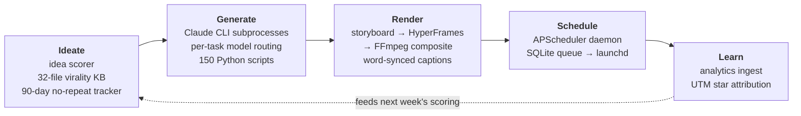

# content-machine

An autonomous, single-operator content studio: ideation → production (blog + video) → repurposing → scheduled auto-publish, across 3 niches and 7 platforms, at 200+ published pieces per month.

> Personal system, not a packaged product. It runs my content operation end-to-end; published here to share the architecture. Expect hard-coded paths, opinionated conventions, and no install script.

## What it does

*One blog run fans out into every derivative — platform posts, carousel, deck, reel brief, thumbnail, worksheet — and the analytics loop closes back onto idea scoring, so what performed last week changes what gets written next week.*

## Architecture highlights

- **150 Python scripts, one orchestration model** — all active code in `v1/scripts/`; entry points: `run_blog_pipeline.py` (one idempotent run produces every derivative of a blog: platform posts, social images, carousel, deck, reel brief, thumbnail, worksheet), `run_video_pipeline.py` (raw footage → trim → storyboard → HyperFrames per-beat compositions → FFmpeg composite), `run_voiceover_week.py` (audio-first lane: VO → B-roll montage long-form + auto portrait Shorts), `scheduler.py` (APScheduler daemon).
- **Per-task LLM model routing** — a single routing table (`v1/scripts/lib/niche_config.py`) assigns the right Claude model per task: top tier only for quality-critical hero content, workhorse tier for generation, small models strictly for mechanical classification. No model IDs hard-coded at call sites.
- **Claude CLI as the LLM runtime** — pipeline calls run `claude -p` subprocesses on subscription auth (no API key), with disk caching, timeout budgets per stage, and backoff only on transient failures.
- **Virality as configuration** — a 32-file knowledge base injects hooks, CTAs, and guardrails into every generator, routed per niche. Editing markdown changes generation behavior; prompts are versioned in code, never copy-pasted.
- **Honesty guardrail** — build-in-public posts about my open-source tools are generated with an explicit never-overclaim constraint per project.
- **Closed loop** — UTM-tagged repo links + analytics collection tie published content directly to GitHub star deltas, which feed the next week's idea scoring.

## Stack

Python · Claude CLI (model-routed) · HyperFrames · FFmpeg · APScheduler · SQLite · launchd · Meta Graph API · YouTube (4 channels) · Medium · LinkedIn

## Related tools

- [autopilot-jobhunt](https://github.com/tarunlnmiit/autopilot-jobhunt) — autonomous job-search agent  · PyPI · MCP
- [inbox-to-action](https://github.com/tarunlnmiit/inbox-to-action) — one-pass agentic inbox triage (PyPI, MCP)

## Author

Tarun Gupta — [tarunlnmiit.github.io](https://tarunlnmiit.github.io) · [Case study of this system](https://tarunlnmiit.github.io/case-studies/ai-content-machine.html)
